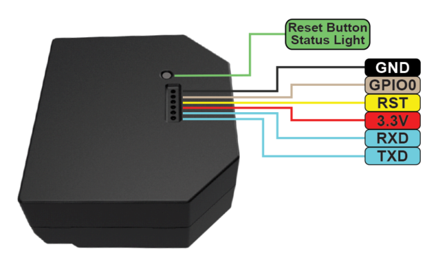

# Shelly 2.5

Connect UART following .

You also need to get into flash mode by connecting GPIO0 to ground.

- Shelly1-RX -> FTDI-TX (IMPORTANT: Shelly1 RX is connected to TX on FTDI!)
- Shelly1-TX -> FTDI-RX (IMPORTANT: Shelly1 TX is connected to RX on FTDI!)
- Shelly1-3.3v -> FTDI VCC (VERY IMPORTANT: make sure to set the voltage jumper correctly on the FTDI is set to 3.3v, otherwise you risk frying the Shelly)
- Shelly-GPIO0 -> FTDI GND
- Shelly-GND -> FTDI GND 

IMPORTANT: **BOTH** GPIO0 and GND on the Shelly need to be connected to GND on FTDI to get the SHelly into flash mode, just doing one of them won't work

Config taken from https://esphome-configs.io/devices/shelly-25/

More examples can be found there, the one being used here does not use all the features from the Shelly 2.5

```sh
virtualenv .venv && source .venv/bin/activate
pip install esphome

esphome shelly25.yaml run
```