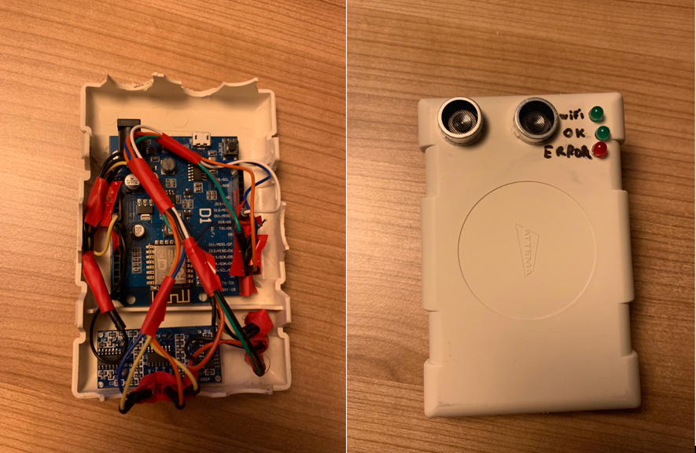

# Deskheight sensor

Simple arduino-based sensor to determine the height of my standing desk.

Workflow:

1. **[main.ino](main.ino)**: Attempt to connect to wifi network (blink WIFI LED while connecting, WIFI LED on when connected).
2. **[main.ino](main.ino)**: Determine desk height by measuring 3 times in rapid succession and taking the max value (this smooths out sensor readings).
3. **[main.ino](main.ino)**: Send a basic json payload with the deskheight to my home server (blink SUCCESS LED).
4. **[main.ino](main.ino)**: In case of any issues, blink ERROR LED.
5. **home server**: listen on port and dump incoming json to file using logstash
6. **home server**: for every incoming request, [create according sensor in home-assistant](https://github.com/jorisroovers/casa/blob/ce0c68003c419736bfeb247acb640d994b75a856/roles/elk_logstash/templates/http-to-file.conf) using logstash
7. **home server**: in home-assistant, [use template sensor to determine whether desk is up or down based on sensor value](https://github.com/jorisroovers/casa/blob/633c4f768bd15269a6761f05a1fd03ab5628caef/roles/homeassistant/templates/configuration.yaml#L231-L242).

# Pictures




# Bill of Materials
- [Wemos D1](https://www.aliexpress.com/item/Latest-WEMOS-D1-R2-V2-1/32745953143.html) (=cheap arduino clone with wifi chip)
- [Arduino compatible ultrasonic sensor HC-SR04](https://www.aliexpress.com/item/Free-shipping-1pcs-Ultrasonic-Module-HC-SR04-Distance-Measuring-Transducer-Sensor-for-Arduino-Samples-Best-prices/32640823431.html)
- [Arduino compatible 9V Power adapter](https://www.aliexpress.com/item/10pcs-Lot-AC-100V-240V-Converter-Adapter-DC-9V-1A-Power-Supply-EU-Plug-DC-5/32533135054.html)
- Some LEDs (optional) to indicate connectivity to WiFi network and logstash server.

# Wiring Diagram
TODO :-)

# Code
The code can be found in [main.ino](main.ino).

Requires some a ```secrets.h``` file that sits in the same directory that looks like:

```
#define SECRET_WIFI_SSID "myssid";
#define SECRET_WIFI_PASSWORD "mysecretpassword";
#define SECRET_HTTP_HOST "10.1.1.1"
#define SECRET_HTTP_PORT 1234
#define SECRET_HTTP_USER "secret-user"
#define SECRET_HTTP_PASSWORD "secret-password"
```